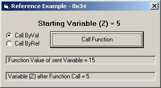

## ByValReftest

### Description

This is an example of the difference between the &#8220;ByVal&#8221; reference and the &#8220;ByRef&#8221; reference. It explains the differences between the two and why it is so important to use the right one.
 
### More Info
 

             |
---                |---
**Submitted On**   |2006-10-15 16:30:08
**By**             |[0x34](https://github.com/Planet-Source-Code/PSCIndex/blob/master/ByAuthor/0x34.md)
**Level**          |Beginner
**User Rating**    |4.7 (14 globes from 3 users)
**Compatibility**  |VB 5\.0, VB 6\.0
**Category**       |[Coding Standards](https://github.com/Planet-Source-Code/PSCIndex/blob/master/ByCategory/coding-standards__1-43.md)
**World**          |[Visual Basic](https://github.com/Planet-Source-Code/PSCIndex/blob/master/ByWorld/visual-basic.md)
**Archive File**   |[ByValRefte20251110152006\.zip](https://github.com/Planet-Source-Code/0x34-byvalreftest__1-66787/archive/master.zip)

